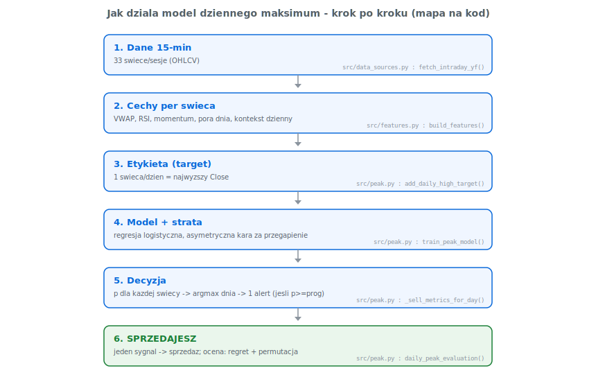
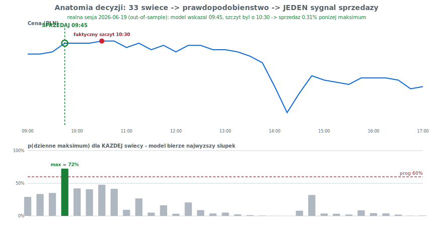

# Jak działa model dziennego maksimum (back-end krok po kroku)

> **Jedno zadanie:** raz w ciągu sesji wysłać sygnał „**TERAZ jest szczyt dnia,
> sprzedaj**”. Dostajesz jeden alert → sprzedajesz → koniec. Ten dokument
> tłumaczy *co* dzieje się w kodzie i *dlaczego* to działa. Skupia się tylko na
> tym zadaniu (tryb `peak`); reszta narzędzi to analiza pomocnicza.

---

## Mapa: od świec do jednego sygnału



Cały model to **6 kroków**. Poniżej każdy z osobna — z fragmentem kodu i
wyjaśnieniem, dlaczego jest taki, a nie inny.

---

## Krok 1–2: dane i cechy

Sesja GPW to ~**33 świece 15-minutowe** (09:00–17:00). Dla każdej świecy
liczymy wektor cech — to „oczy” modelu. Najważniejsze (`src/features.py`):

| Cecha | Co mówi modelowi | Dlaczego pomaga znaleźć szczyt |
|---|---|---|
| `dist_from_vwap_pct` | jak wysoko cena jest nad średnią ważoną wolumenem | szczyt to zwykle silne wybicie ponad VWAP |
| `minute_of_day` | która to godzina sesji | szczyt SCW często wypada rano (09:00 w 41% dni) |
| `ret_1`, `ret_5` | pęd ostatnich 1/5 świec | szczyt poprzedza świeży, szybki wzrost |
| `vol_zscore` | nietypowość wolumenu | górki rodzą się na podwyższonym obrocie |
| `rsi_14` | wykupienie/wyprzedanie | wysokie RSI = rynek „przegrzany” |

**Dlaczego per świeca, a nie raz na dzień?** Bo pytanie brzmi „czy *ta* świeca
jest szczytem”. Model ocenia każdą z 33 świec osobno, w miarę jak sesja się
rozwija — dokładnie tak, jak działałby na żywo (widzi świecę dopiero po jej
zamknięciu, bez zaglądania w przyszłość).

---

## Krok 3: etykieta — czym jest „szczyt”

```python
# src/peak.py
def add_daily_high_target(feat_df):
    for _, g in feat_df.groupby("date"):
        top_idx = g["Close"].idxmax()      # świeca z najwyższym Close w sesji
        flags.loc[top_idx] = 1             # dokładnie JEDNA jedynka na dzień
```

Uczymy model rozpoznawać **jedną świecę dziennie** — tę z najwyższym kursem
zamknięcia. To „osiągalny sufit”: najlepszy moment, w którym realnie mogłeś
sprzedać. Konsekwencja: klasy są skrajnie niezbalansowane — tylko **~3%** świec
to szczyt (1 z 33), 97% to „nie-szczyt”. To wymusza specjalną funkcję straty.

---

## Krok 4: model i funkcja straty (sedno „dlaczego to działa”)

Model to **regresja logistyczna**: liniowa kombinacja cech ściśnięta do
prawdopodobieństwa funkcją sigmoidalną.

```
z = b₀ + Σⱼ wⱼ · (xⱼ − średniaⱼ)/odchylenieⱼ      # ważona suma cech (po standaryzacji)
p(szczyt) = 1 / (1 + e^(−z))                       # zamiana liczby na prawdopodobieństwo 0–1
```

Uczy się przez minimalizację **ważonej entropii krzyżowej**:

```
L = − (1/N) · Σᵢ  w[yᵢ] · [ yᵢ·log(pᵢ) + (1−yᵢ)·log(1−pᵢ) ]
      w[1] = daily_high_fn_penalty   (kara za błąd na świecy-szczycie)
      w[0] = 1
```

```python
# src/peak.py
LogisticRegression(class_weight={0: 1.0, 1: penalty})   # penalty = daily_high_fn_penalty
```

**Dlaczego waga `w[1]`, i dlaczego to robi model przewidywalnym.** Gdyby
wszystkie błędy ważyły tak samo, model przy 97% „nie-szczytów” nauczyłby się
mówić zawsze „nie szczyt” — formalnie miałby niski błąd, ale **nigdy by nie
zaalarmował** (bezużyteczny). Mnożąc karę za *przegapienie szczytu* przez
`penalty`, zmuszamy model, by traktował te rzadkie świece-szczyty poważnie.
Im wyższy `penalty`, tym agresywniej szuka górki — i to jest pokrętło, którym
**świadomie sterujesz** kompromisem „częściej alarmuj” ↔ „alarmuj tylko gdy
pewny”.

**Dlaczego regresja logistyczna, a nie las/sieć?**
1. **Interpretowalność** — widać dokładnie wagę każdej cechy (wykres niżej).
2. **Mało parametrów** — przy zaledwie 57 przykładach szczytu złożony model by
   się przeuczył; prosty model jest stabilniejszy = bardziej przewidywalny.
3. W porównaniu rodzin modeli wypadła najlepiej (szczegóły w `RAPORT_ANALIZA.md`).

**Co model faktycznie się nauczył** (realne wagi):


Najsilniejsze: `dist_from_vwap_pct` (+) — wysoko nad VWAP = szczyt; oraz
`minute_of_day` (−) — im później, tym mniej prawdopodobnie (premia za poranek).
To są intuicyjne, „ludzkie” reguły — dlatego model jest przewidywalny, a nie
czarną skrzynką.

---

## Krok 5: decyzja — jeden sygnał na dzień

```python
# src/peak.py  (_sell_metrics_for_day)
alert_i = int(proba.argmax())                      # świeca o NAJWYŻSZYM p w dniu
fired   = proba[alert_i] >= alert_probability_threshold
```

Model liczy `p(szczyt)` dla wszystkich 33 świec, a potem bierze **jedną
najwyższą**. Jeśli przekracza próg → **alert** (sprzedajesz). Jeśli żadna nie
przekroczy → brak alertu (trzymasz do zamknięcia). Tak gwarantujemy **max 1
sygnał dziennie** — dokładnie to, czego chcesz: jeden strzał, sprzedaż, koniec.

### Anatomia jednej, prawdziwej decyzji



Na realnej sesji testowej (out-of-sample, model jej nie widział): górny panel —
cena; dolny — `p(szczyt)` dla każdej świecy. Model wybiera najwyższy słupek
(zielony) i tam pada sygnał „SPRZEDAJ”. Czerwona kropka to faktyczny szczyt.
W tym dniu sygnał wypadł tuż obok szczytu — sprzedaż **0.31% poniżej** maksimum.

---

## Krok 6: czy to działa? (przewidywalność, nie magia)

Trzy niezależne sprawdziany na danych, których model nie widział:

**(a) Regret — jak blisko górki sprzedajesz.**


Średnio **1.72% poniżej** dziennego maksimum — lepiej niż sprzedaż na otwarciu
(2.32%), losowa (2.78%) czy trzymanie do końca (3.58%).

**(b) Test permutacyjny — czy to nie przypadek.** Tasujemy 1000× przypisanie
prawdopodobieństw do świec; gdyby model nic nie umiał, regret byłby taki jak
losowy. Wynik: **1.72% vs 3.06%, p-value 0.003** — przewaga jest istotna
statystycznie.

**(c) Sweep kary — sterowalność.**


Kara = 1 → model w ogóle nie alarmuje (regret 3.58%). Kara = 12 → 9/11 dni,
regret 1.72%. Kara = 30 → alarmuje codziennie, regret 1.24%. Zachowanie zmienia
się **monotonicznie i przewidywalnie** wraz z jednym parametrem.

---

## Uczciwe granice

- Tylko **57 przykładów szczytu** — mała próba, duża wariancja.
- Trafienia „co do świecy” (±1) to ~36%; ale *cenowo* jesteś blisko (regret
  ~1.7%), bo wokół maksimum cena jest płaska.
- Dane live z yfinance mają **~15 min opóźnienia** → realny alert bywa spóźniony.

**Wniosek:** to narzędzie wskazuje *fazę* „teraz górka, sprzedaj”, blisko
optimum i mierzalnie lepiej niż przypadek — ale jest wsparciem decyzji, nie
gwarancją. Pełne liczby i wykresy: [`RAPORT_ANALIZA.md`](RAPORT_ANALIZA.md).
