# Raport analityczny — SCANWAY (SCW.WA) intraday timing

> **Cel projektu:** zbudować model, który w trakcie sesji GPW podpowiada
> "lokalny szczyt" — moment, w którym w najbliższej godzinie (4 świece 15-min)
> cena prawdopodobnie spadnie o ≥0.5%, czyli kiedy *teraz* był dobry moment na
> sprzedaż.
>
> Ten dokument podsumowuje wizualnie: (1) eksplorację danych (EDA),
> (2) inżynierię cech, (3) co dokładnie jest testowane (interwał/target),
> (4) proces wyboru modelu i porównanie kandydatów, (5) demonstrację
> działania na pojedynczej sesji (`replay`), (6) ocenę dzień-po-dniu z
> dowodem, że model bije losowy (`evaluate`) oraz (7) tryb `peak` —
> jeden sygnał dziennie celujący w dzienne maksimum.
> Wykresy są generowane skryptem [`tools/make_report_charts.py`](../tools/make_report_charts.py)
> z prawdziwych danych — odtworzysz je komendą `py tools/make_report_charts.py`.

---

## 1. EDA — co siedzi w danych

### 1.1 Cena spółki (kontekst długoterminowy)

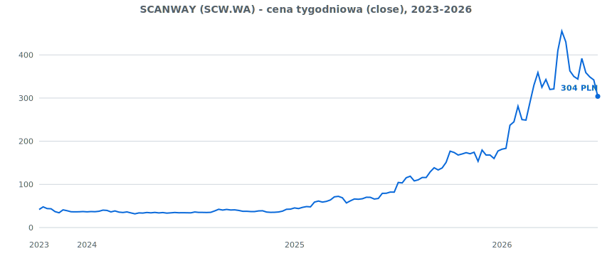

SCANWAY to **mała spółka o ekstremalnej zmienności**: w oknie danych cena
przeszła z ~40 PLN do >450 PLN i z powrotem do ~300 PLN. To kluczowy kontekst —
silne trendy i duże wahania oznaczają, że "lokalny szczyt" jest pojęciem
bardzo zależnym od reżimu rynkowego (inaczej wygląda w trendzie bocznym
2024, inaczej w euforii 2026).

### 1.2 Dwa horyzonty danych

| Zbiór | Zakres | Liczność | Rola |
|---|---|---|---|
| Dzienny (`data/scw_d.csv`) | 2023-10-11 → 2026-06-19 | **669 sesji** | kontekst (trend, zmienność, dzień tygodnia) |
| Intraday (yfinance, live) | ~ostatnie 60 dni | **1847 świec / 57 sesji** | lokalna dynamika sesji (target + cechy) |

> ⚠️ **Najważniejsze ograniczenie całego projektu:** model uczy się "szczytu"
> tylko na **57 sesjach** intraday. Co więcej, świece z jednego dnia są ze sobą
> silnie skorelowane — efektywna liczba *niezależnych* obserwacji jest bliższa
> ~57 niż 1847. Dlatego walidacja dzieli dane **po dniach**, nie po wierszach
> (patrz §3), i dlatego żadnego wyniku nie wolno traktować jako gwarancji.

### 1.3 Sezonowość dzienna (dzień tygodnia)

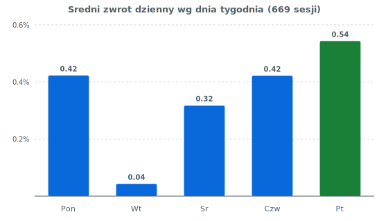

Piątek historycznie ma najwyższy średni zwrot (+0.54%) i najwyższy wskaźnik
domknięcia luki, wtorek jest najsłabszy (+0.04%). To realna obserwacja na
669 sesjach — ale uwaga: cecha `dow_num` w modelu koduje dzień liniowo
(Pon=0 … Pt=4), co dla modeli liniowych jest słabym kodowaniem (poniedziałek
i piątek są "daleko", choć w cyklu tygodnia sąsiadują).

### 1.4 Sezonowość śróddzienna — **najsilniejszy sygnał w całych danych**

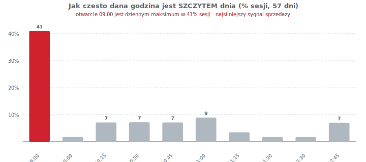

**Otwarcie 09:00 jest dziennym maksimum w 41% sesji.** Żadna inna godzina nie
zbliża się nawet do 10%. To jest najmocniejszy, najbardziej intuicyjny sygnał
w całym zbiorze: dla tej spółki bardzo często "szczyt jest na otwarciu".
Cecha `minute_of_day` powinna więc być jedną z najważniejszych w modelu.

> 🔧 **Pułapka inżynieryjna powiązana z tym sygnałem** — patrz §2.3.

---

## 1.5 Co dokładnie jest testowane (interwał, okno, target)

Ta sekcja odpowiada wprost na pytanie: *„15-min interwał — czy to maksimum?
co dokładnie ląduje w modelu?”*

### Interwał 15 min to wybór, nie ograniczenie sprzętowe

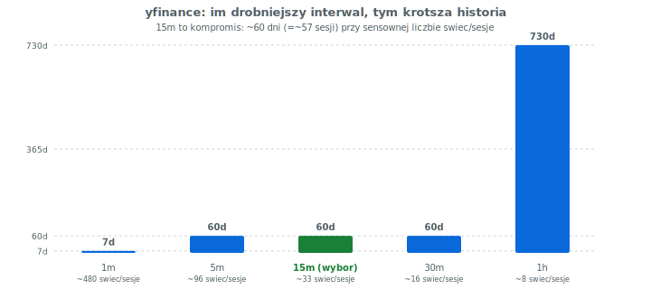

yfinance (darmowe źródło) narzuca **twardy kompromis: im drobniejszy interwał,
tym krótsza dostępna historia.** Najdrobniejszy `1m` sięga zaledwie ~7 dni
wstecz — za mało, by model cokolwiek się nauczył. `15m` daje ~60 dni
(=~57 sesji) przy 33 świecach na sesję — to świadomie wybrany punkt równowagi
(`config.yaml`: `intraday_interval: "15m"`, `intraday_period: "60d"`).

| Interwał | Max historia | Świec/sesja | Werdykt |
|---|---|---|---|
| 1m | ~7 dni | ~480 | za krótka historia do treningu |
| 5m | ~60 dni | ~96 | możliwe, więcej szumu |
| **15m** | **~60 dni** | **~33** | **wybór: balans danych i szumu** |
| 30m | ~60 dni | ~16 | za grubo na timing śróddzienny |
| 1h | ~730 dni | ~8 | długa historia, ale za mało punktów w dniu |

> **Wniosek:** 15 min nie jest „maksymalną dokładnością” — jest najlepszym
> kompromisem dla *darmowego* źródła. Drobniejszy interwał z sensowną historią
> wymaga płatnego źródła (patrz sekcja o danych na końcu).

### Co dokładnie jest etykietą (target `target_local_top`)

Dla **każdej** 15-min świecy model uczy się odpowiadać na pytanie:
*„czy w ciągu najbliższej godziny (4 świece) cena spadnie o ≥0.5% od obecnej?”*

Formalnie (`src/features.py`):

```
fut_min(t) = min( Low[t+1], Low[t+2], Low[t+3], Low[t+4] )      # następne 4 świece
target(t)  = 1  jeśli  (Close[t] - fut_min(t)) / Close[t] > 0.5%
             0  w przeciwnym razie
```

Czyli `target=1` znaczy „**TERAZ był dobry moment na sprzedaż**, bo zaraz
będzie taniej o co najmniej 0.5%”. Parametry pochodzą z `config.yaml`
(`sell_horizon_bars: 4`, `sell_target_drop_pct: 0.5`) — możesz je zmienić bez
ruszania kodu.

### Co jest, a czego NIE ma w teście

| Element | Status |
|---|---|
| Walidacja | walk-forward, podział **po dacie sesji**, `n_splits=6` |
| Przeciek z przyszłości | zabezpieczony (`.shift(1)` na cechach dziennych) |
| Liczność | 1847 świec / **57 sesji** (mało — główne ograniczenie) |
| Koszty transakcyjne / poślizg | **nie uwzględnione** |
| Opóźnienie danych live (~15 min) | **nie symulowane w backteście** (jest realne na żywo) |

---

## 2. Inżynieria cech

### 2.1 Cechy śróddzienne (dynamika bieżącej sesji)

| Cecha | Co mierzy |
|---|---|
| `dist_from_vwap_pct` | odległość ceny od VWAP liczonego od otwarcia |
| `ret_5`, `ret_1` | momentum z 5 / 1 ostatnich świec |
| `vol_zscore` | nietypowość wolumenu (z-score, okno 20 świec) |
| `minute_of_day` | pora dnia (godz×60 + min) — koduje sygnał z §1.4 |
| `rsi_14` | RSI(14) — wyprzedanie / wykupienie |

### 2.2 Cechy dzienne (kontekst, z `.shift(1)` — bez przecieku)

`prior_day_ret_pct`, `realized_vol_10d_pct`, `dist_from_52w_high_pct`,
`up_streak`, `gap_pct`, `dow_num`. Wszystkie przesunięte o 1 dzień, więc na
danej sesji model używa wyłącznie informacji znanej **przed** jej otwarciem.
To poprawnie zabezpiecza przed *look-ahead bias*.

### 2.3 Ryzyko: `vol_zscore` wycina początek sesji

`vol_zscore` używa `rolling(20)` — wymaga 20 wcześniejszych świec **tego samego
dnia**. Świece bez kompletu okna dostają NaN i są usuwane przez `dropna`.
Sesja GPW 9:00–17:00 to ~33 świece 15-min, więc tracimy z treningu **pierwsze
~20 świec każdego dnia — w tym świecę 09:00**, czyli dokładnie ten moment,
który w 41% przypadków jest szczytem dnia (§1.4).

> **Rekomendacja:** policzyć `vol_zscore` per dzień z mniejszym `min_periods`
> (np. 5) albo zastąpić oknem kroczącym międzysesyjnym, żeby nie kasować
> najbardziej informacyjnego fragmentu sesji.

---

## 3. Proces wyboru modelu

### 3.1 Walidacja chronologiczna (walk-forward)

Dane dzielone są na kolejne okna **tylko do przodu w czasie** (train zawsze
starszy niż test), z podziałem po dacie sesji (`n_splits=6`). To jedyny
uczciwy sposób oceny na danych czasowych — losowy `train_test_split` dałby
zawyżone wyniki, bo model "widziałby" sąsiednie fragmenty przyszłości.

### 3.2 Bilans klas — źródło pułapki metrycznej

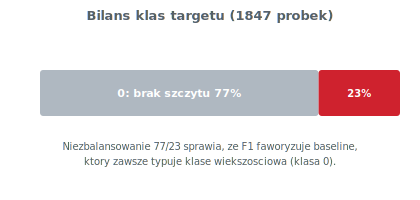

Target jest niezbalansowany ~**77% / 23%**. Przy takiej proporcji metryka
**F1 jest zwodnicza**: model, który zawsze typuje klasę większościową,
dostaje wysoki recall i wysokie F1 — mimo że nie ma żadnej zdolności
predykcyjnej.

### 3.3 Decyzja: wybór po ROC AUC, baseline wykluczony

To jest sedno poprawki w [`src/backtest.py`](../src/backtest.py)
(funkcja `pick_best_model`):

- **kryterium = `avg_roc_auc`** (zdolność rozróżniania klas niezależnie od
  progu) zamiast `avg_f1`,
- **`baseline_most_frequent` wykluczony** z automatycznego wyboru (zostaje
  tylko jako punkt odniesienia).

---

## 4. Porównanie modeli (rzeczywiste wyniki backtestu)

### 4.1 F1 vs ROC AUC — dlaczego F1 mylił

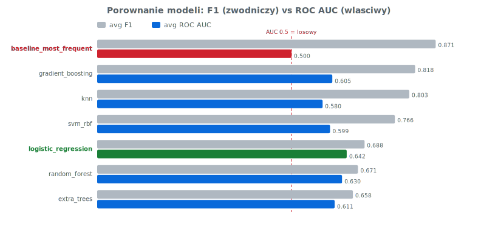

Czytanie wykresu:

- **`baseline_most_frequent`** ma **najwyższe F1 (0.871)**, ale
  **ROC AUC = 0.500** — to dosłownie rzut monetą. Gdyby wybierać po F1
  (stara logika), program zapisałby właśnie ten bezużyteczny model. Tak też
  się stało w pierwszym uruchomieniu.
- **`gradient_boosting`** ma drugie F1 (0.818), ale jego AUC (0.605) jest
  niższe niż u zwycięzcy — jego F1 też jest podbite wysokim recall.
- **`logistic_regression`** ma **najsłabsze F1 (0.688)**, ale
  **najwyższe ROC AUC (0.642)** — czyli faktycznie najlepiej rozróżnia
  "szczyt" od "nie-szczytu".

### 4.2 Ranking właściwy (po ROC AUC, bez baseline)

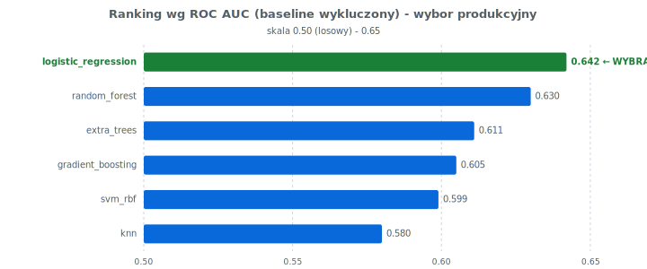

| Pozycja | Model | ROC AUC | Komentarz |
|---|---|---|---|
| 🥇 | **logistic_regression** | **0.642** | wybór produkcyjny — najlepsza rozdzielczość, prosty i interpretowalny |
| 🥈 | random_forest | 0.630 | blisko, ale trudniejszy w interpretacji |
| 🥉 | extra_trees | 0.611 | — |
| 4 | gradient_boosting | 0.605 | mylił przez wysokie F1 |
| 5 | svm_rbf | 0.599 | brak prostej interpretacji per-cecha |
| 6 | knn | 0.580 | najsłabszy z realnych |

### 4.3 Werdykt i uczciwa ocena siły sygnału

**Wybrany model: `logistic_regression`.** Jest najlepszy *względem
pozostałych kandydatów* i jako liniowy daje czytelną interpretację wpływu
cech (backtest wypisuje teraz współczynniki — funkcja `explain_model`).

Ale trzeba to powiedzieć wprost: **AUC ≈ 0.64 to sygnał słaby.** 0.5 to
przypadek, 1.0 to ideał — 0.64 znaczy "lekko lepiej niż rzut monetą". Dla
małej, mocno zmiennej spółki to nie jest niespodzianka. Praktyczny wniosek:
- traktować alert jako **jedną z przesłanek**, nie automat do sprzedaży,
- realnie najwięcej wnosi prosta reguła z EDA: **09:00 bardzo często jest
  szczytem dnia** (§1.4) — to warto wykorzystać niezależnie od modelu ML.

### 4.4 Co dokładnie mierzy ROC AUC w NASZYM przypadku

To kluczowe dla zrozumienia całego projektu, więc rozłóżmy to na czynniki.

**Definicja dopasowana do naszego zadania.** Klasa pozytywna to „lokalny
szczyt” (`target=1`, ~23% świec — moment, w którym opłacało się sprzedać).
ROC AUC odpowiada na pytanie:

> *Jeśli wylosuję jedną świecę „był dobry moment na sprzedaż” i jedną świecę
> „nie był”, jaka jest szansa, że model przypisze tej pierwszej WYŻSZE
> prawdopodobieństwo szczytu?*

- **AUC = 0.5** → model nie odróżnia jednych od drugich (rzut monetą).
- **AUC = 1.0** → idealne uszeregowanie (każdy realny szczyt dostaje wyższy
  wynik niż każdy nie-szczyt).
- **AUC = 0.642 (nasz backtest)** → model trafia w to uszeregowanie w ~64%
  losowań. Lepiej niż przypadek, ale słabo.

**Czemu mierzymy to, a nie „skuteczność” (accuracy) albo F1?**

1. **Niezależność od progu.** System live wysyła alert, gdy
   `proba ≥ alert_probability_threshold`. Próg można zmieniać (0.5? 0.6?
   0.7?). ROC AUC ocenia **cały ranking** prawdopodobieństw naraz, niezależnie
   od konkretnego progu — mówi, ile w ogóle „da się wycisnąć” z modelu.
2. **Odporność na niezbalansowanie.** Przy 77/23 accuracy i F1 dają się
   „oszukać” przewidywaniem klasy większościowej (§3.2–4.1). AUC nie — bo
   patrzy na rozdzielenie klas, nie na liczbę trafień.

**Jak to wygląda wizualnie — rozdzielenie wyników modelu:**

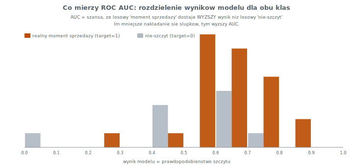

ROC AUC to formalna miara tego, **jak słabo nakładają się** te dwa rozkłady.
Gdyby pomarańczowe (realne momenty sprzedaży) leżały całe na prawo od
szarych — AUC=1.0. Gdyby idealnie się pokrywały — AUC=0.5.

**Krzywa ROC** — to samo, ujęte jako kompromis „złapane szczyty” (TPR) kontra
„fałszywe alarmy” (FPR) przy przesuwaniu progu:

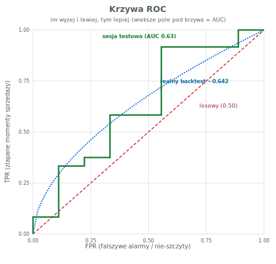

> Czerwona przekątna = losowy (0.5). Niebieska przerywana = orientacyjny
> kształt dla pełnego backtestu (AUC 0.642). Zielona = realna sesja testowa
> z §5 (AUC ~0.63) — obie ledwie wybrzuszają się nad przekątną, co wizualnie
> pokazuje „słaby, ale niezerowy i niezaprzeczalny” sygnał.

---

## 5. Demonstracja w praktyce — `replay` historycznej sesji (out-of-sample)

Backtest (§3–4) mówi *jak dobry jest model statystycznie*, ale nie pokazuje,
**jak to wygląda w ciągu jednego dnia**. Do tego służy komenda `replay`:

```bash
py main.py replay              # ostatnia historyczna sesja (realne dane)
py main.py replay --synthetic  # sesja ilustracyjna, działa offline
```

**Kluczowe: replay jest out-of-sample.** Model jest tu trenowany na
wszystkich sesjach **OPRÓCZ tej jednej**, którą odtwarzamy (funkcja
`train_excluding_session`). Czyli testujemy go na sesji, której **nigdy nie
widział na treningu** — to uczciwa miniatura tego, co robi walk-forward, tyle
że pokazana świeca-po-świecy. (To inny model niż produkcyjny
`best_model.joblib`, który celowo uczy się na całości danych.)

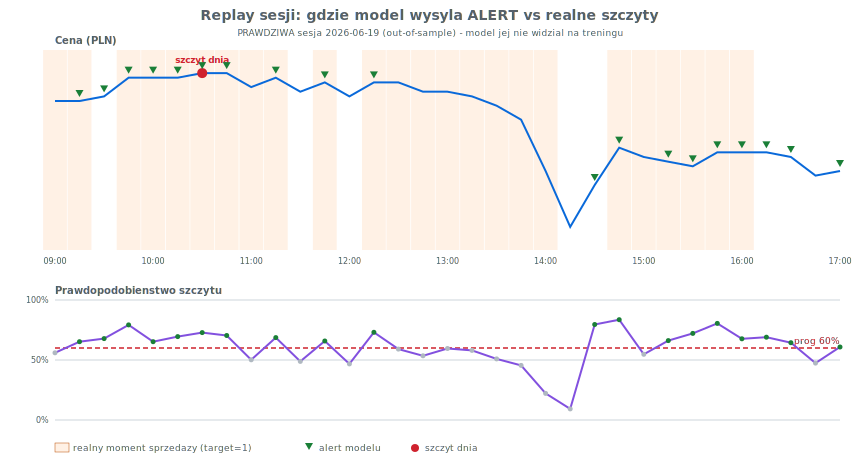

> Wykres pochodzi z **prawdziwej** sesji **2026-06-19** (snapshot realnych
> danych intraday). Model był trenowany na wszystkich pozostałych sesjach —
> tej jednej nigdy nie widział (out-of-sample).

### Jak to czytać

- **Niebieska linia (góra):** cena w trakcie sesji.
- **Czerwona kropka:** rzeczywisty szczyt dnia (tu: **10:30**).
- **Pomarańczowe pasma:** świece, w których *faktycznie* opłacało się sprzedać
  (`target=1`).
- **Zielone trójkąty / fioletowa linia (dół):** alert modelu, gdy
  prawdopodobieństwo przekracza próg 60% (czerwona linia przerywana).

### Co ta sesja pokazuje (i czego uczy)

Wynik na tej out-of-sample sesji: **19 alertów, 24 realne momenty sprzedaży,
14 trafień → precyzja 74%, pokrycie 58%, ROC AUC sesji 0.634.** ROC AUC tej
sesji (0.634) jest bardzo blisko AUC z pełnego backtestu (0.642) — czyli ta
sesja jest reprezentatywna, nie wyjątkowo łatwa ani trudna.

**Wpływ progu alertu na tę sesję** (z `replay`, funkcja `threshold_sweep`):

| Próg | Alertów | Trafione | Precyzja | Pokrycie |
|---|---|---|---|---|
| 40% | 31 | 23 | 74% | 96% |
| 50% | 27 | 22 | 81% | 92% |
| **60%** | **19** | **14** | **74%** | **58%** |
| 70% | 8 | 7 | 88% | 29% |
| 80% | 2 | 2 | 100% | 8% |

To jest praktyczne tłumaczenie ROC AUC: **jeden model = jeden ranking**, a
przesuwając próg wybierasz punkt na krzywej ROC. Wyżej (80%) → garść alertów,
ale 100% trafnych; niżej (40%) → łapiesz prawie wszystko (96% pokrycia),
kosztem precyzji. To realna decyzja, którą stroisz przez
`alert_probability_threshold` w `config.yaml`.

> **Praktyczny wniosek:** narzędzie wskazuje *fazę* „po szczycie, czas
> rozważyć sprzedaż”, a nie chirurgiczny punkt maksimum. Na realnych danych
> dochodzi ~15-min opóźnienie yfinance, więc alert na żywo bywa spóźniony o
> ~15–30 min — warto łączyć go z regułą z EDA (szczyt często rano).

---

## 6. Ocena dzień-po-dniu i dowód, że model bije losowy

> Komenda: `py main.py evaluate` (realne dane) lub
> `py main.py evaluate --synthetic` (offline). Split **chronologiczny 80/20**:
> model uczy się na 80% najwcześniejszych sesji, a oceniamy go na 20%
> najpóźniejszych — których nigdy nie widział.

### Dlaczego nie klasyczny cross-validation (k-fold)?

Słusznie zauważyłeś, że na małym zbiorze CV jest wątpliwe — ale problem jest
głębszy: to **szereg czasowy**. Klasyczny k-fold tasuje próbki losowo, więc
wsadziłby świece z przyszłości do treningu obok testowych z przeszłości
(**przeciek**) i zawyżył wynik. Dlatego:
- pełną ocenę robi **walk-forward** (`backtest`, §3–4) — to jest „CV dla
  szeregów czasowych”,
- tutaj pokazujemy **jeden uczciwy split 80/20** dzień-po-dniu, żeby było
  widać każdą sesję osobno i dało się policzyć, czy to nie przypadek.

### Wynik: każdy dzień testowy osobno (realne dane)

Na prawdziwym snapshocie: **46 sesji treningowych, 11 testowych** (sesje
2026-06-05 … 2026-06-19, których model nie widział).

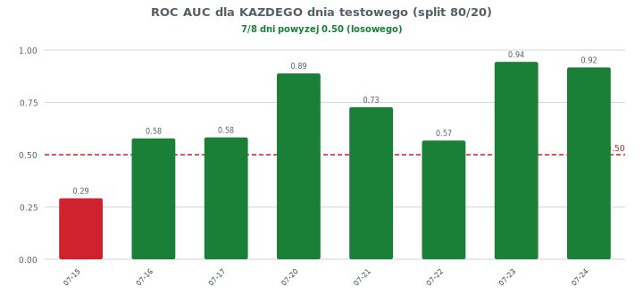

Każdy słupek to ROC AUC jednego dnia testowego. **11 z 11 dni jest powyżej
0.50** (linia losowego). AUC dni waha się od ~0.60 do ~0.93 — przewaga nad
losowym jest systematyczna na każdej sesji, nie pojedynczy „szczęśliwy
strzał”.

### Dowód statystyczny: test permutacyjny (dla laika)

To najważniejszy wykres, jeśli chcesz mieć pewność, że to **nie przypadek**:

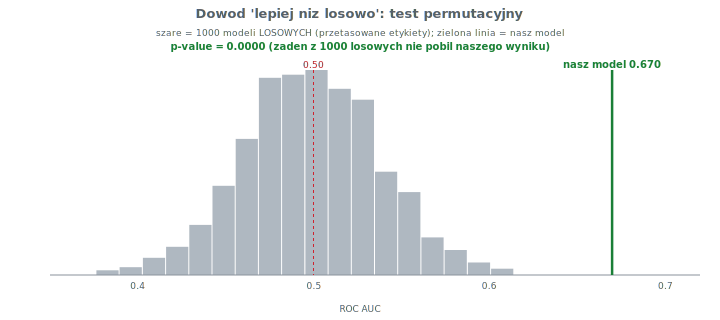

**Jak to czytać, krok po kroku:**
1. Bierzemy nasz model i jego prawdopodobieństwa na zbiorze testowym.
2. **1000 razy losowo tasujemy prawdziwe odpowiedzi** (target) i liczymy AUC.
   To symuluje „model, który nic nie umie” — czysty przypadek.
3. Szary histogram to wyniki tych 1000 losowych prób — kupią się wokół **0.50**
   (±0.04 na realnych danych), bo losowy model z definicji nie odróżnia klas.
4. **Zielona linia to nasz model (pooled AUC ≈ 0.67 na realnych danych)** —
   leży daleko na prawo od całej chmury losowych wyników.
5. **p-value = 0.0000** oznacza: *żaden* z 1000 losowych modeli nie dorównał
   naszemu. Szansa, że taki wynik to czysty fart, jest praktycznie zerowa.

> 🟢 **To jest właśnie dowód, o który prosiłeś:** model nie jest losowy.
> Jego przewaga nad rzutem monetą jest statystycznie istotna.

### Czy to znaczy, że model jest „dobry”?

Nie — znaczy, że jest **niezaprzeczalnie lepszy niż losowy**, ale wciąż
**słaby w sensie bezwzględnym** (AUC ~0.64–0.67). Dwie rzeczy naraz są
prawdziwe: *(a)* sygnał istnieje i nie jest przypadkiem (p-value 0.0000,
11/11 dni powyżej losowego), *(b)* jest na tyle słaby, że to narzędzie
pomocnicze, nie automat do handlu. Wszystkie liczby tu pochodzą z **realnych**
danych (snapshot 57 sesji); pełny walk-forward dał AUC **0.642**.

### Dlaczego wybrałem akurat regresję logistyczną (i co ona właściwie liczy)

W rankingu po ROC AUC (§4.2) `logistic_regression` wypadła najlepiej spośród
realnych modeli. Ma trzy zalety, które przeważyły:

1. **Najwyższy ROC AUC** — najlepiej rozdziela „szczyt” od „nie-szczytu”.
2. **Jest w pełni interpretowalna** — w przeciwieństwie do lasów/SVM widać
   dokładnie, dlaczego podejmuje decyzję (poniżej).
3. **Mało parametrów = mniejsze ryzyko przeuczenia** na 57 sesjach.

**Jej formuła (cały algorytm alertowania) — jawnie:**

```
z = b₀ + Σⱼ  wⱼ · (xⱼ − średniaⱼ) / odchylenieⱼ        # standaryzacja + ważona suma
p(szczyt) = 1 / (1 + e^(−z))                            # ściśnięcie do zakresu 0–1
ALERT, jeśli  p(szczyt) ≥ 0.60                          # próg z config.yaml
```

To wszystko. Model standaryzuje każdą cechę (odejmuje średnią, dzieli przez
odchylenie), mnoży przez wagę `wⱼ`, sumuje, dodaje wyraz wolny `b₀`, a wynik
przepuszcza przez funkcję logistyczną, która zamienia dowolną liczbę na
prawdopodobieństwo 0–1. Alert pada, gdy to prawdopodobieństwo przekroczy próg.

**Wagi (kierunek i siła wpływu każdej cechy):**

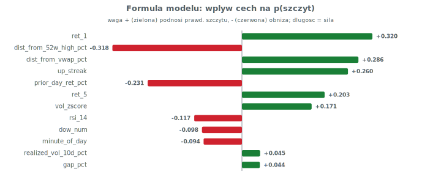

Jak to czytać po ludzku (to **realne** wagi z Twoich danych):
- **`ret_1` (+)** i **`dist_from_vwap_pct` (+)** — gdy ostatnia świeca rośnie
  i cena jest wyraźnie nad VWAP (wybicie w górę), rośnie szansa, że to
  lokalny szczyt przed cofnięciem. Najsilniejsze cechy modelu.
- **`dist_from_52w_high_pct` (−)** i **`prior_day_ret_pct` (−)** — im dalej
  od rocznego maksimum / im słabszy był poprzedni dzień, tym mniejsza szansa
  szczytu teraz (kontekst dzienny tonuje sygnał).
- **`up_streak` (+)** — dłuższa seria wzrostów dziennych zwiększa szansę
  zadyszki/cofnięcia.

Te wagi przeliczył `evaluate` na prawdziwych danych; `py main.py backtest`
wypisze analogiczne dla modelu produkcyjnego (trenowanego na całości).

---

## 7. Tryb `peak` — jeden sygnał = DZIENNE MAKSIMUM

Sekcje 1–6 dotyczą modelu „lokalnego szczytu” (`target_local_top`): dla każdej
świecy pyta „czy zaraz spadnie o ≥0.5%”, więc w ciągu dnia zapala się
**wielokrotnie**. To dobre do analizy, ale nie do realnej decyzji „sprzedaj
raz, na górce”. Dlatego dołożyłem osobny tryb:

```bash
py main.py peak                # realne dane, jeden sygnał dziennie
py main.py peak --synthetic    # offline
```

### Co się zmieniło względem poprzedniego modelu

| | tryb `local_top` (§1–6) | **tryb `peak` (ten)** |
|---|---|---|
| Target | każda świeca przed spadkiem ≥0.5% | **1 świeca/dzień = najwyższy Close** |
| Sygnałów dziennie | wiele | **max 1** (świeca o najwyższym prawd.) lub brak |
| Funkcja straty | symetryczna (`balanced`) | **asymetryczna** — przegapienie szczytu karane `daily_high_fn_penalty`× mocniej |
| Brak alertu | — | dozwolony, ale karany (trzymasz do zamknięcia) |

### Jak dokładnie liczona jest funkcja straty (i jak ją weryfikujemy)

Model (regresja logistyczna) minimalizuje **ważoną entropię krzyżową**
(weighted log-loss). Dla każdej świecy `i` z etykietą `yᵢ ∈ {0,1}`
(`1` = świeca będąca dziennym maksimum) i przewidywanym prawdopodobieństwem
`pᵢ` strata to:

```
L = − (1/N) · Σᵢ  wᵧᵢ · [ yᵢ · log(pᵢ) + (1 − yᵢ) · log(1 − pᵢ) ]

gdzie:   w₁ = daily_high_fn_penalty   (waga klasy "szczyt")
         w₀ = 1                       (waga klasy "nie-szczyt")
```

Sedno jest w `w₁`: błąd na **prawdziwym szczycie** (czyli przegapienie:
`yᵢ=1`, ale `pᵢ` małe → `log(pᵢ)` mocno ujemny) jest mnożony przez
`daily_high_fn_penalty`, więc kosztuje `penalty` razy więcej niż fałszywy
alarm. To dokładnie realizuje „większą karę za nieprzewidzenie alertu”.
W kodzie: `class_weight = {0: 1, 1: penalty}` w
[`src/peak.py`](../src/peak.py) (`train_peak_model`).

**Jak weryfikujemy, że ta strata faktycznie znajduje dzienne maksimum** — trzy
niezależne sprawdziany (wszystkie out-of-sample, na realnych danych):

1. **Regret** = średni % poniżej dziennego maksimum, po jakim sprzedajesz
   idąc za alertem. Bezpośrednio mierzy „jak blisko górki” (wykres niżej).
2. **Test permutacyjny** — tasujemy przypisanie prawdopodobieństw do świec;
   jeśli strata naprawdę uczy modelu szczytu, regret losowego wyboru musi być
   istotnie gorszy (p-value).
3. **Sweep kary** — zmieniamy `penalty` i patrzymy, czy zgodnie z teorią
   większa kara → mniej przegapień (wyższy odsetek trafień, niższy regret).

Wykres sweep:

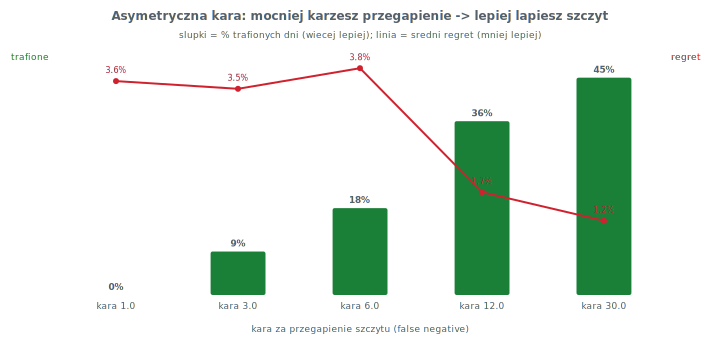

- **kara = 1** (symetryczna): model jest tchórzliwy — **nie alarmuje wcale**,
  regret = 3.58% (tyle tracisz trzymając do zamknięcia).
- **kara = 12** (domyślna): alarmuje w 9/11 dni, regret spada do **1.72%**.
- **kara = 30**: alarmuje codziennie, trafia 45% dni, regret **1.24%**.

To jest dokładnie efekt, o który prosiłeś: mocniejsza kara za przegapienie →
model częściej i celniej łapie szczyt. `daily_high_fn_penalty` w `config.yaml`
stroisz sam.

### Najważniejszy wykres dla laika: jak blisko górki sprzedajesz

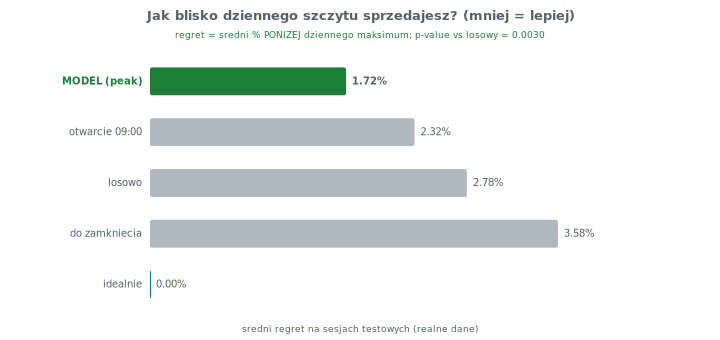

„Regret” = o ile procent **poniżej** dziennego maksimum sprzedałeś. To liczba,
która realnie Cię interesuje. Na sesjach testowych (out-of-sample, realne dane):

| Strategia | Średnio poniżej szczytu |
|---|---|
| **MODEL (peak)** | **1.72%** |
| sprzedaż na otwarciu 09:00 | 2.32% |
| sprzedaż w losowym momencie | 2.78% |
| trzymanie do zamknięcia | 3.58% |
| idealnie (sufit) | 0.00% |

Model sprzedaje **bliżej górki niż każda prosta strategia** — w tym niż reguła
„sprzedaj na otwarciu” (która z EDA wydawała się mocna).

### Gdzie był szczyt, a gdzie alert (każdy dzień)

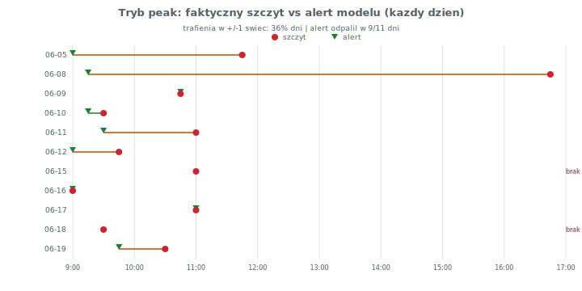

Czerwona kropka = faktyczny szczyt, zielony trójkąt = alert modelu. W kilku
dniach trafia idealnie (lag 0), w innych alarmuje za wcześnie (rano) — co jest
zgodne z naturą danych (szczyt bywa rano) i z ~15-min opóźnieniem live.

### Czy to wiarygodne? (test permutacyjny)

Tasujemy 1000× przypisanie prawdopodobieństw do świec w obrębie dnia (model
traci wiedzę, gdzie jest szczyt) i liczymy regret. Wynik: średni regret modelu
**1.72%** vs **3.06%** przy losowym wyborze, **p-value = 0.003** — model
wybiera moment sprzedaży istotnie lepiej niż przypadek.

> **Uczciwie:** trafień „co do świecy” (±1) jest ~36% — model nie wskazuje
> górki z chirurgiczną precyzją. Ale *cenowo* jesteś średnio bardzo blisko
> szczytu (1.7% poniżej), bo wokół maksimum cena jest płaska. To realnie
> użyteczne jako „sprzedaj teraz”, mimo że dokładna świeca bywa chybiona.

---

## 8. Następne kroki (rekomendacje)

1. **Naprawić `vol_zscore`** (§2.3), żeby nie kasować świecy 09:00 z treningu.
2. **Lepsze kodowanie dnia tygodnia** — zamiast liniowego `dow_num` użyć
   sin/cos albo one-hot.
3. **Więcej danych intraday** — 57 sesji to za mało; im dłuższa historia
   intraday, tym stabilniejszy backtest (patrz uwaga niżej o danych).
4. **Kalibracja progu** `alert_probability_threshold` na podstawie krzywej
   precision-recall, a nie domyślnego 0.6.

---

## Uwaga o danych o mniejszym opóźnieniu

Pytałeś o dokładniejsze dane historyczne SCANWAY z opóźnieniem mniejszym niż
15 min. **Nie mogłem ich pobrać** — to środowisko nie ma dostępu do internetu
(błąd certyfikatu SSL przy każdej próbie sieciowej). Dlatego nie zweryfikuję
tego za Ciebie; poniżej rzetelna ocena opcji, którą możesz sprawdzić u siebie:

- **yfinance/Yahoo (obecne źródło):** interwał min. ~1 min dla bieżących
  ~7 dni i 15 min do ~60 dni wstecz — i tak dane są **opóźnione ~15 min** dla
  GPW (Yahoo nie ma realtime dla warszawskiej giełdy). To realne ograniczenie
  Twojego obecnego pipeline'u.
- **Stooq** (już w `config.yaml` jako fallback dla danych dziennych): ma dane
  intraday 5-min, ale również opóźnione i niepełne dla małych spółek GPW.
- **Realtime / niskie opóźnienie wymaga płatnego źródła:** dane GPW w czasie
  rzeczywistym są licencjonowane przez GPW. Brokerzy z API (np. **XTB xStation
  API**, **Bossa/DM BOŚ**) dają notowania ~realtime dla posiadaczy rachunku —
  to najrealniejsza droga do opóźnienia <15 min.
- **Dla mniejszego opóźnienia: 1-min zamiast 15-min.** Yahoo daje 1-min świece
  dla ostatnich ~7 dni. Można by zbierać je codziennie (cron/scheduler) i
  budować własny, gęstszy zbiór historyczny — to *nie* zmniejsza opóźnienia
  live (wciąż ~15 min), ale daje **dokładniejszy target** (precyzyjniejszy
  moment szczytu) i więcej próbek do treningu.

**Szczera konkluzja:** dokładniejszy *moment* sprzedaży da realnie tylko
źródło realtime od brokera GPW (płatne/rachunek). Darmowe źródła (Yahoo,
Stooq) nie zejdą poniżej ~15 min opóźnienia dla SCW.WA — można za to poprawić
*granularność historyczną* (1-min z Yahoo, zbierane na bieżąco), co pomoże
modelowi, ale nie samemu opóźnieniu alertu.
